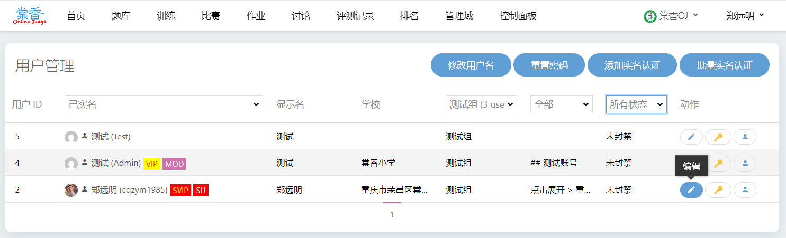
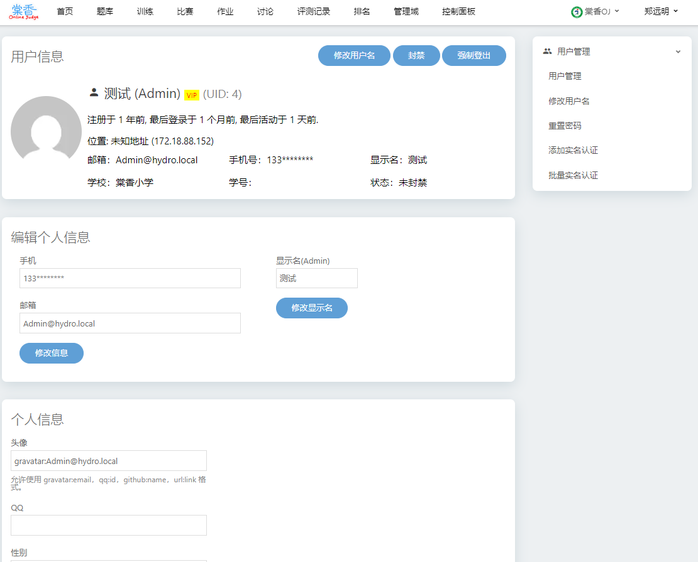

## 自用hydro-plugins

本插件使用了以下开源项目的部分或全部内容，感谢这些项目的开发者提供的大力支持。

感谢 33DAI https://github.com/open33oj/hydro-plugins

感谢 Godtokoo666 https://github.com/Godtokoo666/badge-for-hydrooj

感谢 bowen404 https://github.com/15921483570/hydrooj-cancelavatar

感谢 Hongshi0622 https://github.com/Hongshi0622/Hydro-Bulk-Message

### 当前支持的版本 Hydro v5。不兼容 Hydro v4。

部分功能截图预览





## 功能简介

### 徽章

1.管理员可发放徽章，一个徽章可以发放给多个用户，一个用户可拥有多个徽章，但每次只能展示一个徽章，用户可选择启用或停用徽章。by Godtokoo666

2.用户profile下拉栏「我的徽章」。by Godtokoo666

3.用户资料页面展示获得的徽章。by cqzym1985

### 硬币

1.管理员可发放硬币、查看发放记录。by 33DAI

2.管理员可批量发放硬币。by cqzym1985

3.兑换商城，管理员可添加、管理商品。by cqzym1985

4.用户可兑换商品。by cqzym1985

5.用户间可相互赠送硬币。by cqzym1985

6.自动发放硬币。在 管理域「硬币设置」里开启功能。by cqzym1985

7.使用硬币可修改用户名，首次修改免费。在 控制面板「系统设置」里设置修改用户名所需硬币数量。by cqzym1985

### 用户管理

1.查看所有用户，可按登陆时间等筛选用户。by cqzym1985

2.可封禁和解禁用户、修改用户的用户名、修改用户的资料等。by cqzym1985

3.重置密码。by cqzym1985

4.添加实名认证、查看实名认证。by 33DAI

5.批量实名认证。by cqzym1985

### 倒计时

1.仿洛谷样式的倒计时插件。by cqzym1985

### 剪贴板

1.剪贴板插件。by 33DAI

### 使用 QQ 登录

1.使用 QQ 登录。by cqzym1985

### 前端修改

1.取消上传头像功能 by bowen404

2.不显示首页的排行榜中的个人简介。by 33DAI

3.去掉了边栏最近题目的时间。by 33DAI

4.添加了一个可以在控制面板设置的边栏导航。by 33DAI

5.按个人喜好去掉了footer一些内容，添加了修改声明。by 33DAI

6.顶部导航显示“显示名”。by cqzym1985

7.训练页显示用户名字。by cqzym1985

8.依赖badge插件、 coin 插件与 realname 插件。在个人页面展示徽章、硬币数量、实名信息、并隐藏掉个人简介。by 33DAI && Godtokoo666

9.修改了训练列表的样式。by 33DAI

### 拓展

1.排行榜去掉了个人简介的部分，新增小组信息、评测记录查看。by cqzym1985

2.普通管理员不能切换用户至超级管理员。by cqzym1985

3.限制普通管理员查看「脚本管理」、「用户权限」、「系统设置」、「配置管理」。by cqzym1985

4.超级管理员（PRIV.PRIV_ALL）可管理站内消息。by cqzym1985

5.管理员可管理所有人的文件。by cqzym1985

6.批量设置用户的角色和小组。入口：管理域「批量设置用户权限」。by cqzym1985

7.批量发送消息给小组或个人。入口：管理域「批量发送消息」 by Hongshi0622

## 安装方法

1.新建插件 `hydrooj addon create`

2.复制文件到 /root/.hydro/addons/下。

3.添加插件

  添加徽章插件：`hydrooj addon add /root/.hydro/addons/badge`

  添加硬币插件：`hydrooj addon add /root/.hydro/addons/coin`

  添加用户管理插件：`hydrooj addon add /root/.hydro/addons/users_manage`

  添加倒计时插件：`hydrooj addon add /root/.hydro/addons/countdown`

  添加剪贴板插件：`hydrooj addon add /root/.hydro/addons/pastebin`

  添加 QQ 登录插件：`hydrooj addon add /root/.hydro/addons/login-with-qq`

  添加前端修改插件：`hydrooj addon add /root/.hydro/addons/frontend`

  添加拓展插件：`hydrooj addon add /root/.hydro/addons/extension`

4.重启程序：`pm2 restart hydrooj`

## “倒计时”和“边栏导航”功能添加

  - 使用：进入 `控制面板`-`系统设置`-`hydrooj.homepage`，如下配置好需要展示的链接

```
  countdown:
    title: 倒计时
    max_dates: 3
    dates:
      - name: 劳动节
        date: 2025-05-01
      - name: 端午节
        date: 2025-05-31
      - name: 儿童节
        date: 2025-06-01
      - name: 建党节
        date: 2025-07-01
      - name: 建军节
        date: 2025-08-01

  sidebar_nav:
    - title: 常用功能
      urls:
      - name: 查看徽章
        url: ./badge/show
      - name: 查看硬币
        url: ./coin/show
      - name: 管理用户
        url: ./users
    - title: 常用 OJ
      urls:
      - name: 33OJ
        url: https://oj.33dai.cn/
      - name: QLUOJ
        url: https://icpc.qlu.edu.cn/
      - name: HydroOJ
        url: https://hydro.ac/

```

## 权限配置：

  - `PRIV.PRIV_SET_PERM`：可以管理徽章、管理硬币、管理用户等。

## 反馈交流 `QQ:7414085`

## https://oj.ac.cn
